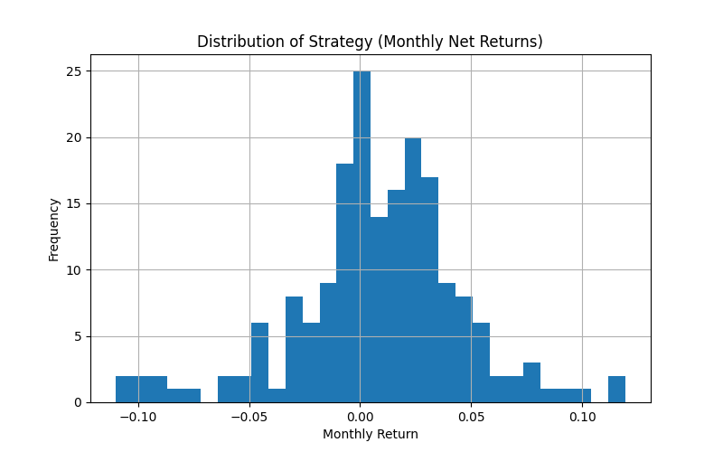
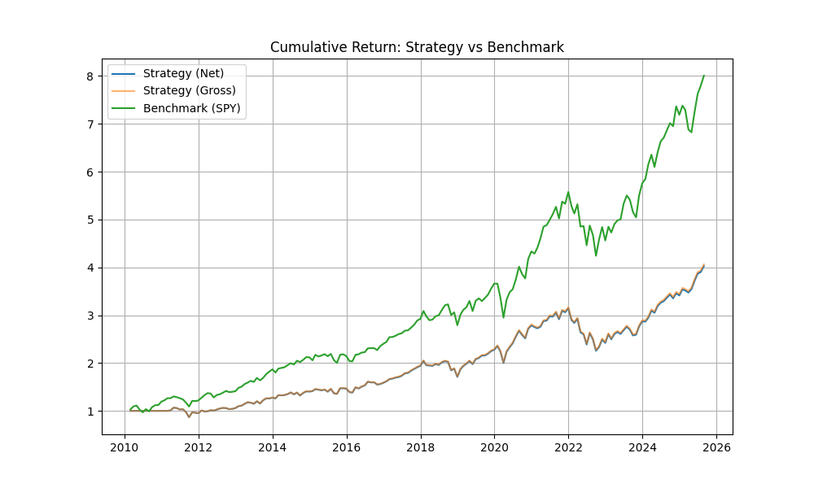

# Quantitative Strategy - 美國 ETF 動能 TopN 策略

本專案實作並回測一個 **ETF 動能選股 TopN 策略**，主要包含資料處理、策略回測、績效比較與評估。  

---

## 📌 專案架構

- **美國ETF動能策略回測.py**  
  策略主程式，執行回測與投組重平衡。  

- **compare.py**  
  提供基準 (benchmark) 與策略績效比較。  

- **metrics.py**  
  計算各種績效指標 (Sharpe ratio, Max Drawdown, Beta 等)。  

- **utils.py**  
  工具函式：資料處理、Rolling Beta、成本估算等。  

---

## 📈 策略邏輯
1. 計算美國 ETF 的動能表現。  
2. 根據動能排序，挑選前 N 檔 ETF 形成投資組合。  
3. 依照設定的週期 (rebalance period) 進行再平衡。  
4. 與基準指數 (如 SPY) 進行績效比較。  

---

## 📊 回測績效




```markdown
